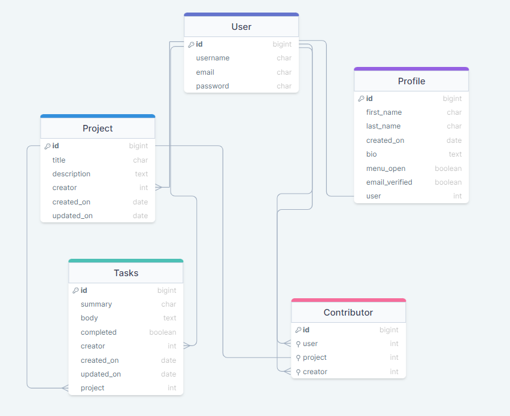

# Devise API

- Devise is planner tool designed to help you share your plans with other. Users can invite contributors to their projects or keep them personal.
- Easily navigate between your own projects or projects that others have invited you to.
- Mark tasks as complete when finished and celebrate together!

- This repository hosts the Django Rest Framework API backend of the project. Follow links below to access front end repository.

## Links

[Link to the live project hosted on Heroku (right click to open in new tab)](https://pp5-devise.herokuapp.com/)

[Link to the live backend API render on Heroku (right click to open in new tab)](https://pp5-devise-api.herokuapp.com/)

[Link to the frontend project repository hosted on Github (right click to open in new tab)](https://github.com/BeckySkel/project-5-frontend)

[Link to the backend project repository hosted on Github (right click to open in new tab)](https://github.com/BeckySkel/project-5-backend)

---
## Table of Contents
- [Strategy](https://github.com/BeckySkel/project-5-backend/blob/main/README.md#strategy)
    - [Target Audience](https://github.com/BeckySkel/project-5-backend/blob/main/README.md#target-audience)
    - [User Stories](https://github.com/BeckySkel/project-5-backend/blob/main/README.md#user-stories)
- [Scope](https://github.com/BeckySkel/project-5-backend/blob/main/README.md#scope)
    - [Testing](https://github.com/BeckySkel/project-5-backend/blob/main/README.md#testing)
- [Structure](https://github.com/BeckySkel/project-5-backend/blob/main/README.md#structure)
    - [Data Model](https://github.com/BeckySkel/project-5-backend/blob/main/README.md#data-model)
- [Skeleton](https://github.com/BeckySkel/project-5-backend/blob/main/README.md#skeleton)
    - [Technologies Used](https://github.com/BeckySkel/project-5-backend/blob/main/README.md#technologies-used)
- [Surface](https://github.com/BeckySkel/project-5-backend/blob/main/README.md#surface)
    - [Deployment](https://github.com/BeckySkel/project-5-backend/blob/main/README.md#deployment)
- [Credits](https://github.com/BeckySkel/project-5-backend/blob/main/README.md#credits)
    - [Content](https://github.com/BeckySkel/project-5-backend/blob/main/README.md#content)
    - [Media](https://github.com/BeckySkel/project-5-backend/blob/main/README.md#media)
    - [Acknowledgemnets](https://github.com/BeckySkel/project-5-backend/blob/main/README.md#acknowledgements)

---
## Strategy

### Target Audience
- This site is targeted towards users who would like to organise a project they're working on with others. This will primarily be adults who are comfortbale working with technology and potentially some older teens/students.

- View [User Personas](documents/personas.pdf)

### User Stories

#### Admin
*These are staff/admin users who maintain the site and manage it's contents.*
- [#2](https://github.com/BeckySkel/project-5-frontend/issues/2) As an **admin**, I can **edit and remove projects, tasks and comments** so that **I can manage the site contents**.

#### General Users
*These are any users who visit the site.*
- [#1](https://github.com/BeckySkel/project-5-frontend/issues/1) As a **user**, I can **create an account** so that **I can create and contribute to projects**.
- [#3](https://github.com/BeckySkel/project-5-frontend/issues/3) As a **user**, I can **create my own project(s)** so that **I can plan and track their progress**.
- [#5](https://github.com/BeckySkel/project-5-frontend/issues/5) As a **user**, I can **add and complete tasks** so that **I can keep track of my progress**.
- [#11](https://github.com/BeckySkel/project-5-frontend/issues/11) As a **user**, I can **customise my profile** so that **other users can identify me easily**.
- [#12](https://github.com/BeckySkel/project-5-frontend/issues/12) As a **user**, I can **create a project calendar** so that **I have a visual representation of the timeline**.
- [#15](https://github.com/BeckySkel/project-5-frontend/issues/15) As a **user**, I can **assign due dates to tasks/projects** so that **I know when they need to be completed by**.
- [#16](https://github.com/BeckySkel/project-5-frontend/issues/16) As a **user**, I can **view a dashboard with reminders and updates** so that **I can easily keep track of my different projects/tasks/comments**.

#### Project Owners
*These are users who have created a project and invited others to contribute*
- [#4](https://github.com/BeckySkel/project-5-frontend/issues/4) As a **project owner**, I can **invite others to contribute to my project** so that **we can collaborate on it**.
- [#7](https://github.com/BeckySkel/project-5-frontend/issues/7) As a **project owner**, I can **set the projects visibility to others** so that **I can decide who views it**.
- [#8](https://github.com/BeckySkel/project-5-frontend/issues/8) As a **project owner**, I can **remove collaborators from a project** so that **they can no longer contribute to or view the contents**.
- [#9](https://github.com/BeckySkel/project-5-frontend/issues/9) As a **project owner**, I can **edit the project brief and workspace** so that **it fits my needs**.
- [#10](https://github.com/BeckySkel/project-5-frontend/issues/10) As a **project owner**, I can **remove the tasks and comments within my project** so that **I can manage the contents**.
- [#14](https://github.com/BeckySkel/project-5-frontend/issues/14) As a **project owner**, I can **categorise tasks** so that **I can group and identify them**.

#### Project Contributors
*These are users who have been invited to a project as a contributor*
- [#6](https://github.com/BeckySkel/project-5-frontend/issues/6) As a **project member**, I can **comment and like/vote on added tasks/ideas** so that **I can share my opinion with the team**.
- [#13](https://github.com/BeckySkel/project-5-frontend/issues/13) As a **user**, I can **tag other users in my comments** so that **they are alerted of it**.

Link to [User Stories Kanban Board](https://github.com/users/BeckySkel/projects/4)
---
## Scope

### Testing
- Throughout the project, I relied on Djangos built in error handling in debug mode as well as printing to the terminal.
- Code was also run through validators and automatic tests were run through Django.
- Please follow [this link](documents/TESTING.md) for full list of tests carried out on the backend of the app

---
## Structure

### Data model

---
## Skeleton

### Technologies used

#### Languages
- [Python](https://en.wikipedia.org/wiki/Python_(programming_language))

#### Imported modules
- [os](https://docs.python.org/3/library/os.html)
- [json]()

#### Installed Libraries
- [cloudinary](https://pypi.org/project/cloudinary/)
- [dj3-cloudinary-storage](https://pypi.org/project/dj3-cloudinary-storage/)
- [gunicorn](https://pypi.org/project/gunicorn/)
- [oauthlib](https://pypi.org/project/oauthlib/)
- [psycopg2](https://pypi.org/project/psycopg2/)
- [Pillow](https://pypi.org/project/Pillow/)
- [dj-rest-auth](https://pypi.org/project/dj-rest-auth/)

#### Frameworks
- [Django](https://www.djangoproject.com/)
- [Django Rest Framework](https://www.django-rest-framework.org/)

#### Other resources
- [Gitpod](https://www.gitpod.io/) to alter and manage website files
- [Github](https://github.com/) to create and store website files
- [Heroku](https://dashboard.heroku.com/apps) to deploy web application
- [Cloudinary](https://cloudinary.com/) for database storage
- [Code Institute](https://codeinstitute.net/) fullstack developer course to provide learning materials
- [W3Schools](https://www.w3schools.com/) for help with common coding issues
- [Geeks For Geeks](https://www.geeksforgeeks.org/)  for help with common coding issues
- [Stack Overflow](https://stackoverflow.com/) for help with common coding issues
- [DrawSQL](https://drawsql.app/) to draw up data model

---
## Surface

### Deployment
- This site was developed using [Gitpod](https://www.gitpod.io/), stored on [Github](https://github.com/) and deployed with [Heroku](https://dashboard.heroku.com/apps).

- Creating the Django App
    1. Use the [Code Intitute](https://github.com/Code-Institute-Org/gitpod-full-template) template repo to create new repository
    2. Signup up for Cloudinary
    2. Open your workspace in Gitpod
    3. Install Django from the terminal with command "pip3 install 'django<4'"
    4. Follow up with "django-admin startproject devise ."
    5. Install dependencies from list below with "pip3 install"
        - asgiref==3.6.0
        - backports.zoneinfo==0.2.1
        - cloudinary==1.32.0
        - dj-database-url==0.5.0
        - dj-rest-auth==2.1.9
        - Django==3.2.18
        - django-allauth==0.52.0
        - django-cloudinary-storage==0.3.0
        - django-cors-headers==3.14.0
        - django-filter==22.1
        - djangorestframework==3.14.0
        - djangorestframework-simplejwt==5.2.2
        - gunicorn==20.1.0
        - oauthlib==3.2.2
        - Pillow==9.4.0
        - psycopg2==2.9.5
        - PyJWT==2.6.0
        - python3-openid==3.2.0
        - pytz==2022.7.1
        - requests-oauthlib==1.3.1
        - sqlparse==0.4.3
    6. Add newly installed apps to settings.py
    7. Create env.py and create the following environment variables
        - CLOUDINARY_URL
        - SECRET_KEY
        - DEV
        - DATABASE_URL
        - ALLOWED_HOST
        - EMAIL_USER
        - EMAIL_PASSWORD
    8. Create Procfile with cotents of "release: python manage.py makemigrations && python manage.py migrate
        web: gunicorn devise.wsgi"

- Debugging on Gitpod:
    1. In the terminal, type "python3 manage.py runserver" and press enter to begin the application
    2. Click "Open in Browser" on the pop-up
    3. Once finished, use Ctrl + C in the terminal to close the application

- Deploying on Heroku:
    1. From the homescreen, click "New" and select "Create new app"
    2. Choose app name, select region and click "Create"
    3. Go to "Settings" and add PORT : 8000 to the Config Vars (CLOUDINARY_URL : {cloudinary url}, DATABASE_URL: {postgres url}, SECRET_KEY: {django secure key} also added but excluded from Github for security reasons)
    4. Add heroku/python buildpack
    5. Go to "Deploy" and connect Github repository
    6. Select "Enable Automatic Deploys" and click "Deploy Branch"

---
## Credits

### Content
- Websites used for initial research:
  - [Asana](https://app.asana.com/) for layout and functionality
  - [Toggle Plan](https://toggl.com/plan/index) for design inspiration
- During test I found it helpful to hide POST/PUT forms when not authenticated, code used to hide forms at [https://forum.djangoproject.com/t/django-rest-framework-404-not-found-put-delete/7980](https://forum.djangoproject.com/t/django-rest-framework-404-not-found-put-delete/7980)
- Signals tutorial and code to connect Profile database to User inspired by [https://www.youtube.com/watch?v=Kc1Q_ayAeQk](https://www.youtube.com/watch?v=Kc1Q_ayAeQk)
- Code for the current user serializer from the Moments CI walkthrough project [Code Institute](https://codeinstitute.net/)
- Contributors model inspired by Followers model in Moments CI walkthrough project [Code Institute](https://codeinstitute.net/) 
- Help with updating email templates from [https://medium.com/@etentuk/django-rest-framework-how-to-edit-reset-password-link-in-dj-rest-auth-with-dj-allauth-installed-c54bae36504e](https://medium.com/@etentuk/django-rest-framework-how-to-edit-reset-password-link-in-dj-rest-auth-with-dj-allauth-installed-c54bae36504e)
- Help with registration endpoints [https://dev.to/willp11/django-part-3-user-authentication-with-dj-rest-auth-and-allauth-4dih](https://dev.to/willp11/django-part-3-user-authentication-with-dj-rest-auth-and-allauth-4dih)
- root_route and logout_route views kindly provided by Moments CI walkthrough project [Code Institute](https://codeinstitute.net/)

### Acknowledgements
- [Code Institute](https://codeinstitute.net/) for providing excellent learning content
- Martina Terlevic as my mentor and providing vital feedback throughout the project's development
- [W3Schools](https://www.w3schools.com/) for quick and easy tutorials on programming languages
- [Geeks For Geeks](https://www.geeksforgeeks.org/) for quick and easy tutorials on programming languages
- The users of [Stack Overflow](https://stackoverflow.com/) for asking and answering some of the harder Django questions
- Other CI students for sharing their work and providing inspiration and guidance through the Slack channels

---

Becky Skelcher 2023